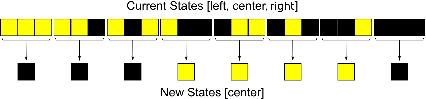

------------------------------------------------------------------------------------------------------------------------------------------------

# Users Guide

### Information

**Users Guide of *CellularAutomataLib***

This package includes the user oriented documentation aimed to facilitate the development of new CA models using *CellularAutomataLib*.

Note that each model or package of the library also contains its own documentation.

**Cellular Automata**

Cellular automata (CA) are a class of models initially proposed in the 1940s by John von Neumann and Stanislaw Ulam.

CA are dynamic, discrete-time and discrete-space models. They are represented as a grid of identical discrete volumes, named cells. The grid can be in any finite number of dimensions. The state of each single cell is finite and it is usually represented using integer numbers. The operational dynamics of the automata is described by a rule or transition function that is used to update the state of each cell at discrete time steps. This rule constitutes a function of the current state of the cell and the state of its neighbors, and defines the state of the cell for the next time step.

* the Moore’s neighborhood that includes all the surrounding cells; 
  
* the von Neumann’s neighborhood that includes the cells adjoining the four faces of one cell;
  
* or the extended von Neumann’s that also includes each cell just beyond one of the four adjoining cells. 
  

As it can be observed, the definition and behavior of the CA are simple. CA can provide an intuitive way of describing complex behavior using simple rules. CA may be considered as discrete idealizations in time and space of physical systems. Due to its simplicity, CA have been used to describe models of complex systems in multiple domains. CA models have been developed in areas like chemistry, economics, medicine, biology and environment, and urban architecture, among many others.

**Structure of the library**

The functionality of the library to construct new CA models in contained in the `Components` package. The data structures and simulation algorihtms that implement the behavior of these components is included in the `Resources/Include/CellularAutomataLib.c` file.

The `Examples` package includes multiple examples arranged by the dimension of their cellular space. These examples demonstrate the functionality of the library and may serve to facilitate the construction of new models. The external C code required to describe new models, and the one used for the examples, is contained in the `Resources/Include/` directory of the library.

The `Test` package includes multiple testing models configured to test the functionality of the library. It includes 1D, 2D and 3D models, that make use of all the components included in the library and all the external C functions included in the `CellularAutomataLib.c` file.
These models can serve to validate any modification performed to the library, either in the Modelica or the C code. A `.mos` script is also distributed (`Resources/run_Test.mos` file) to facilitate the sequential execution of all the test. This script translates and runs each test checking its result, and showing a summary of the results in a message box at the end of the run.

-----------------------------------------------------------------------------------------------------------------------------

### Installation of the library

Please, check the [README.md](README.md) file for installation instructions.

-----------------------------------------------------------------------------------------------------------------------------

### Development of new CA models

A model in _CellularAutomataLib_ is composed of a cellular space, that represents the lattice of cells, including their state (S) and the transition function (δ), and some models, named interface models (i.e., inputs X, Ω, and outputs Y, λ), used as interface between different cellular spaces, or between cellular spaces and other models.

_CellularAutomataLib_ models are composed of a combination of Modelica code and C code. Cellular spaces and interface models are described using Modelica. However, the behavior of cellular spaces and interfaces, and the CA simulation algorithm are implemented using external C functions that are related to their corresponding Modelica mod

The relationship between the external C code and the Modelica code is summarized in the figure below. The file `CellularAutomataLib.c` contains C code used to describe general data structures (e.g., cellular spaces and cells) and functions to implement the CA simulation algorithm. These data structures and functions are common to all CA and should not be modified by the user. The behavior of the model should be defined in another file (e.g., `Model.c`), where the user has to implement the data structure used to describe the state of the cells, its default and initial values and the transition rule. `CellularAutomataLib.c` has to be included in `Model.c` (i.e. `#include <CellularAutomataLib.c>`) in order to use the basic functionality of the library. Once the behavior of the automaton is described in C, the user can describe the cellular spaces and their interfaces using Modelica and relate them with the behavior defined in C. Finally, cellular spaces and interface models can be combined, by means of instances, to describe more complex CA models (e.g., that may include multiple inter-connected cellular spaces and interfaces).

The procedure to create a cellular automata model can be divided in the following steps:

**1\. Description of the Cell State and Rule using External C Code.**

In order to facilitate the description of the behavior of new cellular spaces, the library includes a template file (named draft.c) that can be used to describe the required external C functions.

Following the formal specification of the automata, the user has to define the state variables that represent the state of the cells (S) and the model behavior (i.e., the transition function δ) by reimplementing the functions included in the `Resources/Include/draft.c` file, into a new file (e.g., `model.c`). The time base T is set using the parameters `TStep` and `Initial_step` of the cellular space model. The rest of the elements of the tuple (X, Ω, Y, λ) are defined using the interface models.

As an example, the development of the *Rule30* model described by Wolfram is presented. The transition function for this model is shown in the next figure.

The `draft.c` file can be used as a template to describe the behavior of the model. It has been renamed as `wolfram.c` for this example (this file can also be found in the `Resources/Include/` directory of the library).

The C code corresponding to the description of the state, default and initial functions is shown in file `wolfram.c`. The state of each cell is defined as an int value by modifying the `State` data type in the template (now `RState`). The default value for the cell state will be set using the `RDefaultState` function, and so it has to be modified to set the default state to 0. The `Default` function of the `CellSpace` model will be redeclared using the function `RDefault`, that includes a pointer to `RDefaultState` and a call to the `CS_InitDefault` function, used to set the default state in the cellular space. The state of initialized cells will be set using the `RInitialState` function, and so it has to be modified to set the initial state to 1. The `RInit` function will be used to redeclare the `Initial` function of the `CellSpace` model.

The transition function shown above has to be implemented by modifying the transition function in the template (cf. `rule30` function in `wolfram.c`). In order to automatically generate the graphical animation, the `Display` function in the template (now `RDisplay`) has to be modified to convert the state of the cell (i.e., the `RState` data type) into a `double` value that corresponds to the color that will be displayed for the cell in the animation. The corresponding C code is also shown in file `wolfram.c`.

**2\. Description of New Cellular Spaces in Modelica.**

A cellular space in _CellularAutomataLib_ is composed of the `CS` external object that represents the space; and the cellular space model used to simulate it (`CellSpace`). The external object represents the data structure used to store the information about the space during the simulation. Two functions, `constructor` and `destructor`, are used to initialize this data structure at the beginning of the simulation and destroy it at the end.

The `CellSpace` model is defined as a *partial* model (i.e., a model that can not be directly instantiated) that describes the multi-dimensional space represented by the automaton, and includes the code used to simulate the automaton. Each cellular space instantiates a `CS` external object to represent the space. The characteristics of the `CellSpace` model have to be inherited by another model (i.e., using the `extends` Modelica clause) in order to define a new cellular space. The cellular space model includes three local functions: `Default`, that is used to define the default state of the cells (i.e., cells not initially active). `Initial`, that is used to initialize the state of the cells indicated using the init\_cells parameter, and activate them; and `Rule`, that represents the transition function and is used to update the state of the cells at each simulation step.

At the beginning of the simulation, the `CS` external object is initialized using its `constructor` function, the cellular space defines the default state using the `Default` function and initializes the cells indicated in the `init_cells` parameter using the `Initial` function. After that, it performs periodic simulation steps every `Tstep` time by executing the `Rule` function, starting at `time = Initial_step` (i.e., `sample(Initial_step, Tstep)`). The behavior of the cellular space is described by re-declaring these local functions with other Modelica functions that call external C functions, that contain the desired behavior (e.g., functions implemented using the `draft.c` file).

Following the example of the *Rule30* model, the cellular space is described in Modelica by extending the `CellSpace` model (this model can be found in the library as `CellularAutomataLib.Examples.CS_1D.CSR30`). The `Default`, `Initial` and `Rule` functions of the new cellular space have to be redeclared with functions that call the `RDefault`, `RInitial` and `R30Step` functions previously defined in `wolfram.c`.

The parameters for the *Rule30* model are: `X = 20`,` Y = 10` (to display 10 steps in the animation), `neighborhood = {- 1,1}`, `wrapped_borders = 1`, `Tstep = 1`, `initial_step = 0`, `init_cells = 10`, `name = ”Rule 30”`.

**3\. Graphical Animation.**

_CellularAutomataLib_ supports the generation of a graphical animation during the simulation, to display the evolution of the cellular space. If desired, the graphical animation can be generated using the `Animation` model connected to the `CellSpace` (using the `CAport` connectors in both models). The Raylib library is used to generate the graphics of the animation.

The `Animation` model includes parameters to describe the size of the animation window (`WindowHeight` and `WindowWidth`) and to describe the number of cells that will be displayed in each dimension (`WindowX`, `WindowY`, `WindowZ`). Usually, the number of displayed cells will be equal to those of the cellular space, but this model also supports the representation of aggregate states of multiple cells of the cellular space as a single cell in the animation.

The model also includes three functions used to manage the animation: `SetDisplayFunction` is used to associate a display function with the cellular space; `StepPlot` is the function used to actually display the state of the cells during each step; and `InitAnimation` that is used to initialize the animation window.

The animation is initialized using the parameters of the model and the `InitAnimation` function. The user needs to redeclare the `SetDisplayFunction` with his own display function to define how the state of the cells will be displayed. After that, the animation is periodically updated, following the intervals indicated by the `Tstep` and `intial_step` parameters, using the `StepPlot` function. Currently, only one animation window per simu

The `Animation` model also supports recording the animation during the simulation run and saving it as an mp4 video (H264 format). The `save_video` parameter is used to define if the user wants to save the video or not. The generated video is saved to the current working directory with the name of the animation model.

In the *Rule30* model, state 0 is displayed in black, and state 1 is displayed in yellow (cf. `RDisplay` function in `wolfram.c`). The first 10 steps of simulation are shown below (the number of step is represented in the vertical axis).

**4\. Additional Rules.**

_CellularAutomataLib_ also includes the `AdditionalRule` model to facilitate the application of multiple transition rules to the same cellular space. This model can be used to perform an additional transtition for the cells, simultaneously to the transition already performed by the `CellSpace` model, or to sequentially apply different transition rules to the same space while maintaining the evolution of the cells in the space among different transitions.

Note that for simultaneous transitions, the order in which the different rules are applied depends on the Modelica simulation algorithm.

In order to sequentially apply the additional rule, the model includes the `initial_step`, `Tstep` and `max_step` parameters to define the time to start the execution of the rule, the interval between steps and the maximum number of steps to be performed (these parameters are analogous to those in the `CellSpace` model).

The `AdditionalRule` model includes an `Initial` function, that can be used to re-initialize the state of the selected cells, and a `Rule` function, that corresponds to the transition function. Both functions need to be defined using external C code and redeclared when instantiating the model.

-----------------------------------------------------------------------------------------------------------------------------

# Interfaces with other Modelica models

The library includes five interface models that can be used to combine CA models with other CA or Modelica models.

**Input Region**

_CellularAutomataLib_ supports describing models composed of several cellular spaces. The communication between spaces is described using the Input Region model (`InputRegion`).

The combination of cellular spaces is performed by translating the state of some cells (e.g., a region) from one space as inputs for the another. The prototype of the `Rule` function in C includes a vector of the received inputs, in order to allow the user to manage them during the transition. Each Input Region has associated an input identifier, set using the parameter `input_id`, that can be used as index for the vector of inputs of the transition function.

The Input Region model has two interface ports: `FROM` and `TO`. These interface ports are used to connect to the involved cellular spaces. The state of the cell `[i, j]|i ∈ [XFromRange[1],XFromRange[2]], j ∈ [YFromRange[1],YFromRange[2]]`, and `k ∈ [ZFromRange[1],ZFromRange[2]]` in the `FROM` space, is translated using the `SetInput` function into an input for the cell `[l, m, n]|l ∈ [XTo, XTo + XFromRange[2]-XFromRange[1]], m ∈ [YTo, YTo + YFromRange[2] - YFromRange[1]] , n ∈ [ZTo, ZTo + ZFromRange[2] - ZFromRange[1]]` in the `TO` space. `XFromRange`, `YFromRange`, `ZFromRange`, `XTo`, `YTo`, and `ZTo` are parameters of the model. The communication is started at `time = comm_start` and is performed every `comm_rate` time.

The function `void SetInput(void* Fspace, int Fx, int Fy, int Fz, void* Tspace, int Tx, int Ty, int Tz, int input_id)` from the `draft.c` file can be used to redeclare the *SetInput* function of this model.

**Output Region**

The Output Region model can be used to observe the state of the cells in a region of the automata connected to the `FROM` port. The state is translated into an output _Real_ signal that can be used by other Modelica models. The region of selected cells is defined by the coordinates defined by `XFromRange`, `YFromRange` and `ZFromRange`.

This model has been divided in two, the `OutputRegion` and the `OutputRegionM` models.

The `OutputRegion` model contains an output _Real_ port, `y`. Depending on the value of the parameter `Output_type`, the state is observed in different ways:

* (AVERAGE): the value of `y` is calculated as the average value of the states of the cells in the region.
* (MAX): the value of `y` is calculated as the maximum value of the states of the cells in the region.
* (MIN): the value of `y` is calculated as the minimum value of the states of the cells in the region.
* (SUM): the value of `y` is calculated as the sum of the values of the states of the cells in the region.

The `OutputRegionM` model contains a matrix of output _Real_ ports, `yM[XFromRange[2]-XFromRange[1]+1, YFromRange[2]-YFromRange[1]+1, ZFromRange[2]-ZFromRange[1]+1]`. The value of the state of the i, j, z-th cell in the space is assigned to `yM[l,m,n]` (where `l=1:(XFromRange[2]-XFromRange[1]+1)`, `m = 1:(YFromRange[2]-YFromRange[1]+1)` and `n=1:(ZFromRange[2]-ZFromRange[1]+1)`). Since the size of `yM` can be the size of the cellular space, and the matrix is defined in Modelica, the automatic translation of the model has to manage the definition of `yM` affecting the scalability and the performance of the simulation. This has to be taken into account when including the `OutputRegionM` model in CA models.

The value of the state, in both models, is translated into a _Real_ value using the _ExtOutput_ function, that can be redeclared using the `double ExtOutput(void* space, int x, int y, int z)` function included in `draft.c`.

**External Init Region**

The `ExtInitRegion` model can be used to set the initial state of a region of cells in the space using the value of an external signal. The model has an input port, named `u`, where a _Real_ signal is received, and a port named `TO` that connects to the CA. The value of `u` is translated, using the _ExtInit_ function, into a cell state that will be used to initialize the cells in the region of the connected automaton. If `u` is not connected to another model its value is set to 0.

The region is defined by the coordinates defined by parameters `XRange`, `YRange` and `ZRange`.

The _ExtInit_ function can be redeclared using the `void ExtInit(void* space, int x, int y, int z, double value)` function included in `draft.c`.

**External Input Region**

Similarly to the Input Region model, the model `ExtInputRegion` can be used to set an input to a region of cells in the automata. In this case the input is generated using an external signal instead of the state of the cells of other automata.

This model receives an external _Real_ input signal through port `u`, which is used as input for a region of cells in the automata connected to port `TO`. Similarly to the other interface models, the region is defined by the coordinates declared using parameters `XToRange`, `YToRange` and `ZToRange`.

The input is assigned to the position `input_id` of the vector of inputs, that is available for the user in the transition function. The external signal, `u`, can be observed using the following methods (defined by the parameter `Input_type`), in order to be converted into an input:

* _Quantizer_: the input is set every time the value of the signal changes by a defined value or quantum.
* _Cross\_UP_: the input is set every time the value of the signal crosses a defined threshold in the upwards direction.
* _Cross\_DOWN_: the input is set every time the value of the signal crosses a defined threshold in the downwards direction.
* _Cross\_ANY_: the input is set every time the value of the signal crosses a defined threshold in any direction.
* _Sample_: the input is set periodically using the `sample` operator.

The signal is translated into an input using the function _ExtInput_, that can be redeclared using the `void ExtInput(void* space,int x, int y, int z, double value, int input_id)` function included in `draft.c`.
